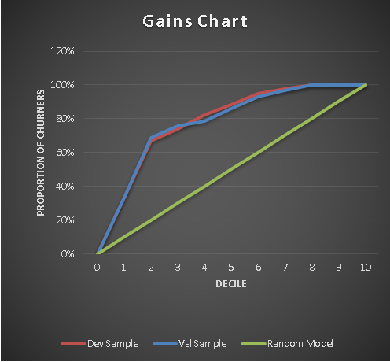
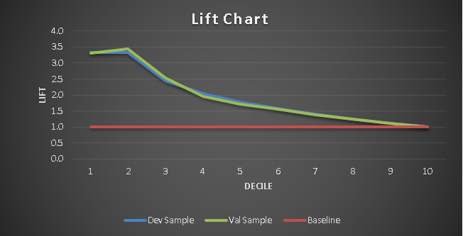

# TelecomChurn
Customer Retention Rate has a strong impact on the customer lifetime value.Understanding the true value of a possible customer churn will help the company in it’s customer relationship management.If we are able to predict the churn customers in advance, the attributes of customers whom we are going to loose in near future one can take corrective action so that we can minimize this problem

# Project Objective
 1. The goal of the study is to apply analytical techniques to predict a customer churn and analyse the churning and non-churning customers.
 2. Develop a system through which the client could identify the customer churn rate and decide what should be the appropriate incentive for them.
 
## Project Results
- Gain chart tells you how well is your model segregating responders from non-responders.

- Lift chart compares the response rates with and without using the classification model.

## How to Use
The Installation process will get you a copy of the project up and running on your local machine for development and testing purposes
1. Clone or download the project into your local machine.
2. Unzip the project folder.
3. Open the source file [TelecomChurnAnalysis Model](WHTA_TelecomChurnAnalysis.ipynb) using [JypyterNotebook](http://jupyter.org/) and execute the file.
4. Instead of step 3, use the classification model loaded in the pickle object to classify churners directly.

## Repository Contains
 - Data -- Contains the raw data folder
 - Images -- Folder contains the images used in python notebook 
 - [TelecomChurnSummary Report](TELECOMCHURNMANAGEMENT.pdf) -- Telecom churn project report
 - [TelecomChurnAnalysis Model](WHTA_TelecomChurnAnalysis.ipynb) -- Project source code file
 - [TelecomChurn-KSChart](TelecomChurn-KSChart.xlsx) -- Excel template to generate lift and gain chart

This project was a part of WHTA course curriculum at praxis business school.

If there are any issues in the code, raise them [here](https://github.com/Niranjankumar-c/TelecomChurn/issues)

## Author
- Connect with me on [linkedin](https://www.linkedin.com/in/niranjankumar-c/).
- Follow me on medium for blogs related to machine learning & deeplearning: 
    - https://towardsdatascience.com/@niranjankumarc
    - https://hackernoon.com/@niranjankumarc

### License
The code and files in this repository is made available for free released under [MIT](LICENSE).
